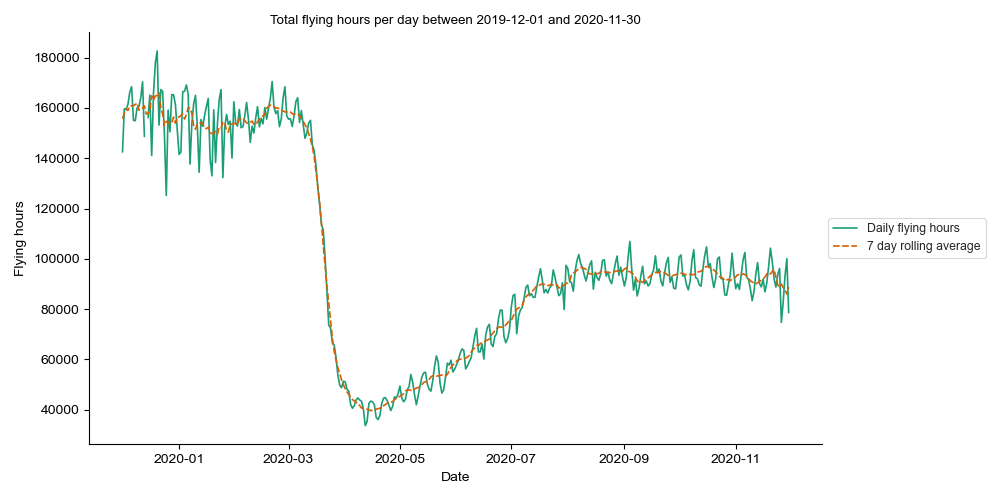
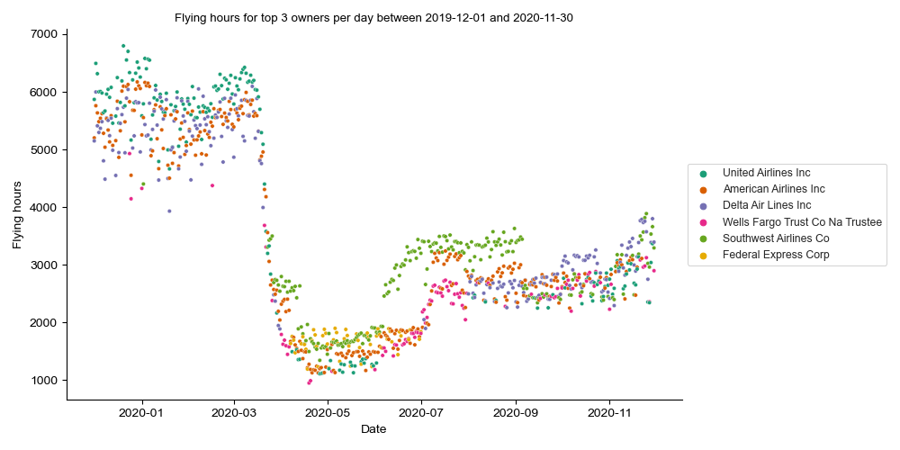

# Analysis of the effect of Covid-19 on air traffic <!-- omit in toc --> 

## Table of Contents <!-- omit in toc --> 
- [Overview](#overview)
- [Database](#database)
  - [Dataset](#dataset)
  - [Setup](#setup)
  - [Connecting securely](#connecting-securely)
- [Analysis Methodology](#analysis-methodology)
  - [What is the overall effect on air traffic?](#what-is-the-overall-effect-on-air-traffic)
  - [What is the effect on specific aircraft?](#what-is-the-effect-on-specific-aircraft)
  - [What is the effect on specific owners?](#what-is-the-effect-on-specific-owners)
- [Results](#results)
  - [What is the overall effect on air traffic?](#what-is-the-overall-effect-on-air-traffic-1)
  - [What is the effect on specific aircraft?](#what-is-the-effect-on-specific-aircraft-1)
  - [What is the effect on specific owners?](#what-is-the-effect-on-specific-owners-1)
- [Conclusion](#conclusion)

## Overview

This project creates and queries a database, consisting of 23,301,070 flights
and 460,000 aircraft, on Google Cloud Platform (GCP) to analyse flying hours
from December 2019 until November 2020. The goal is to answer the business
question *"what has been the effect of Covid-19 on air traffic from an engine
makers perspective?"*. This question has been broken down into three
sub-questions:

1. What is the overall effect on air traffic?
2. What is the effect on specific aircraft?
3. What is the effect on specific owners?

**This project is purely educational. The data and results have not been used
commercially or to generate profit. The database and data have been expunged
upon project completion following the general terms of use & data license
agreement for the dataset. Further information on the dataset and database in
the Database section below.**

## Database

GCP's Cloud SQL was chosen as the relational database service with PostgreSQL as
the relational database management system (RDBMS).

### Dataset

Datasets in CSV format were obtained from [The OpenSky
Network](http://www.opensky-network.org). URLs to the specific dataset locations
are included in the comments of [dbsetup.sql](flyingengines/dbsetup.sql),
although these locations are likely to change over time.

### Setup

The process for creating the database on Cloud SQL was as follows:

1. **Create local database:** pgAdmin 4 was used to create a local database from
   the CSVs using [dbsetup.sql](flyingengines/dbsetup.sql). Two tables were
   created:
      - **traffic:** Consists of data for 23,301,070 flights.
      - **aircraft:** Consists of data for 460,000 aircraft.
2. **Create compressed SQL dump file:** PostgreSQL's pg_dump was used to extract
   the database into a script file. This file was then compressed using Gzip to
   reduce storage costs (not an issue for this project but best practice).
3. **Upload and import file to Cloud SQL:** The .gz file was uploaded to a cloud
   storage bucket and then imported into Cloud SQL.

### Connecting securely

To allow the client to connect to the database, the instance has a Public IP. To
keep the instance secure, only authorised networks can connect. Client/server
SSL certificates are used to authenticate and encrypt connections to the
database instance. The database is configured to only accept SSL connections.
This prevents anyone on the network being able to view or alter the data and
ensures the client is connecting to the server (not a man-in-the-middle).

## Analysis Methodology

The sub-sections below describe the analysis methodology to answer each
sub-question. For each sub-question, the files used consist of the SQL query to
process and extract the data, and a python script that connects to the database
and executes the query using [Psycopg2](https://www.psycopg.org/), and plots the
data using [Matplotlib](https://matplotlib.org/) and
[Seaborn](https://seaborn.pydata.org/).

### What is the overall effect on air traffic?

- **[daily_total.sql](flyingengines/daily_total.sql):** This query returns the
  total flying hours per day. Flights that span multiple days are split such
  that their flying hours are added to the flying hour totals of the days that
  they occurred on. 
- **[daily_total_analysis.py](flyingengines/daily_total_analysis.py):** This
  script connects to the database and executes the query to fetch the data. It
  then calculates the 7 day rolling average from the daily totals, saves the
  data to [daily_total_data.csv](csvs/daily_total_data.csv) and plots the data
  (see results section).

### What is the effect on specific aircraft?

- **[typecode_ranking.sql](flyingengines/typecode_ranking.sql):** This query
  returns the type codes (and their daily flying hours) with the four highest
  flying hours per day. It accounts for flights that span multiple days in the
  same way as daily_total.sql.
- **[typecode_ranking_analysis.py](flyingengines/typecode_ranking_analysis.py):**
  This script connects to the database, executes the query to fetch the data,
  saves the data to [typecode_ranking_data.csv](csvs/typecode_ranking_data.csv)
  and plots the data (see results section).

### What is the effect on specific owners?

- **[owner_ranking.sql](flyingengines/owner_ranking.sql):** This query returns
  the owners (and their daily flying hours) with the four highest flying hours
  per day. It accounts for flights that span multiple days in the same way as
  daily_total.sql.
- **[owner_ranking_analysis.py](flyingengines/owner_ranking_analysis.py):** This
  script connects to the database, executes the query to fetch the data, saves
  the data to [owner_ranking_data.csv](csvs/owner_ranking_data.csv) and plots
  the data (see results section).

## Results

The sub-sections show the plots produced for each subquestion and discuss
possible inferences from them.

### What is the overall effect on air traffic?

The plot of the data returned from the query is shown below.

From this plot, it's clear that Covid-19 has had a substantial and sudden impact
on air traffic. Daily flying hours drop approximately 75% in March and April.
Air traffic has recovered to around 60% of its pre-Covid level, however,
recovery has stalled since August remaining around the 95,000 hour mark. Flying
hours appear to begin dipping towards the end of the date range suggesting that
recovery to pre-Covid levels is while off.

### What is the effect on specific aircraft?

A section of the data returned from the query is shown below.

|  Row  |    Date    | Typecode | Daily flying hours | Ranking |
| :---: | :--------: | :------: | :----------------: | :-----: |
|   0   | 2019-12-01 |   Null   |    30372.185278    |    1    |
|   1   | 2019-12-01 |   B738   |    18765.310833    |    2    |
|   2   | 2019-12-01 |   A320   |    14598.552500    |    3    |
|   3   | 2019-12-01 |   A321   |    6774.375278     |    4    |
|   4   | 2019-12-02 |   Null   |    34360.293889    |    1    |
|  ...  |    ...     |   ...    |        ...         |   ...   |
| 1455  | 2020-11-29 |   B77W   |    4115.507500     |    4    |
| 1456  | 2020-11-30 |   Null   |    25010.279722    |    1    |
| 1457  | 2020-11-30 |   B738   |    7203.375556     |    2    |
| 1458  | 2020-11-30 |   A320   |    4563.964444     |    3    |
| 1459  | 2020-11-30 |   B737   |    3469.383056     |    4    |

For each date, the majority of flights were unclassified with respect to type
code (i.e. the top-ranked type code for each date was Null). This data was
omitted from the plot and could mean that the results from this analysis are
inaccurate. The plot of the data is shown below.

The aircraft manufacturer, model, engines and engine manufacturer for each
aircraft are shown below:

| Typecode | Aircraft Manufacturer |      Model      |        Engines        |                       Engine Manufacturer                        |
| :------: | :-------------------: | :-------------: | :-------------------: | :--------------------------------------------------------------: |
|   B738   |        Boeing         |     737-800     |         CFM56         |                        CFM International                         |
|   A320   |        Airbus         |      A-320      |    CFM56/IAE V2500    |           CFM International/International Aero Engines           |
|   A321   |        Airbus         |      A-321      |    CFM56/IAE V2500    |           CFM International/International Aero Engines           |
|   B77W   |        Boeing         |    777-300ER    |         GE90          |                           GE Aviation                            |
|   B737   |        Boeing         |  737-700/C-40   |         CFM56         |                        CFM International                         |
|   B77L   |        Boeing         | 777-200LR/777-F |         GE90          |                           GE Aviation                            |
|   B744   |        Boeing         |     747-400     |   PW4000/CF6/RB211    |         Pratt & Whitney/GE Aviation/Rolls-Royce Holdings         |
|   B763   |        Boeing         |     767-300     | JT9D/PW4000/CF6/RB211 | Pratt & Whitney/Pratt & Whitney/GE Aviation/Rolls-Royce Holdings |

From the plot, pre-Covid, the aircraft with the highest daily flying hours is
the B738 followed closely by the A320. The A321, which is essentially the A320
with an extended fuselage, and the B77W compete for the third spot. From this
data, CFM International has market dominance, powering the two top aircraft.
Notably, out of the top 4, only the B77W is a wide-body aircraft with the rest
being narrow-body. This suggests there are significantly more short-haul flights
in normal circumstances (in general narrow-body aircraft are used for short-haul
whilst wide-body aircraft are used for long-haul).

Between March and July, Covid-19 has a significant impact on all aircraft, in
particular, the A320 drops out of the top 3 altogether. In this period, a key
takeaway is a rebound from the B77W (taking it briefly into top spot), and the
B737, B77L, B744 and B763 competing for the third spot. Other then the B737,
these are all wide-body aircraft, and this either suggests Covid-19 had less of
an impact on long-haul flying hours or operators shifted to using wide-body
aircraft for more routes. This has resulted in different engine manufacturers
being present in the top 3 (Pratt & Whitney, GE Aviation and Rolls-Royce
Holdings) who target the wide-body/long-haul market.

From July, the B738 and A320 regain rank one and two respectively. However, from
August until the end of the date range, their daily flying hours are trending
down. On the other hand, the B77W shows a gradual increase over this time
period, again suggesting that wide-body aircraft are more resilient to this
crisis.

### What is the effect on specific owners?

A section of the data returned from the query is shown below.

|  Row  |    Date    |              Owner              | Daily flying hours | Ranking |
| :---: | :--------: | :-----------------------------: | :----------------: | :-----: |
|   0   | 2019-12-01 |              Null               |    19186.822778    |    1    |
|   1   | 2019-12-01 |       United Airlines Inc       |    5868.423611     |    2    |
|   2   | 2019-12-01 |      American Airlines Inc      |    5201.518333     |    3    |
|   3   | 2019-12-01 |       Delta Air Lines Inc       |    5148.283333     |    4    |
|   4   | 2019-12-02 |              Null               |    21164.952778    |    1    |
|  ...  |    ...     |               ...               |        ...         |   ...   |
| 1455  | 2020-11-29 |       United Airlines Inc       |    3365.526111     |    4    |
| 1456  | 2020-11-30 |              Null               |    11920.140833    |    1    |
| 1457  | 2020-11-30 |       Delta Air Lines Inc       |    3393.726389     |    2    |
| 1458  | 2020-11-30 |      Southwest Airlines Co      |    3293.078611     |    3    |
| 1459  | 2020-11-30 | Wells Fargo Trust Co Na Trustee |    2896.731111     |    4    |

For each date, the majority of flights were unclassified with respect to owner
(i.e. the top-ranked owner for each date was Null). This data was omitted from
the plot and could mean that the results from this analysis are inaccurate.
Furthermore, some of the names were not consistent, meaning some flights would
not have been grouped correctly. This would result in lower total daily flying
hours for some owners. The plot of the data is shown below.

From the plot, pre-Covid, the top 3 owners are United Airlines Inc, American
Airlines Inc and Delta Air Lines Inc. Generally, United Airlines Inc comes out
on top however the top three owners have similar daily flying hours.

Between March and July, Covid-19 has a significant impact on all owners. Delta
Airlines Inc drops out of the top 3 altogether, and United Airlines Inc and
American Airlines Inc compete for the third spot. Southwest Airlines Co and
Federal Express Corp move into the top two spots. Federal Express Corp moving
into the top 3 suggests that Covid-19 had less of an effect on air freight
traffic relative to passenger traffic.

From July, Southwest Airlines Co makes the quickest and most significant
recovery, however, drops out of the top 3 suddenly in September. This is
probably due to the owner data in the dataset being incomplete. American
Airlines Inc also makes a significant recovery before dropping off slightly and
sitting mid-field for the remainder of the date range. Notably, Wells Fargo
Trust Co Na Trustee moves into the top 3 and remains present until the end of
the date range. These aircraft are leased out to operators, in some cases, in a
sale-leaseback agreement. This is where an operator will sell the aircraft to
quickly raise capital and will lease them back to remain operational. From
September, United Airlines Inc, American Airlines Inc and Delta Air Lines Inc
are the main players in the top 3 with their flying hours trending up near the
end of the date range.

## Conclusion

To conclude, air traffic has been significantly reduced by Covid-19. Whilst
there has been some recovery, this has stalled suggesting that recovery to
pre-Covid levels is while off. Whilst in normal times narrow-body aircraft rack
up more flying hours, wide-body aircraft have shown more resilience to the
general reduction in air traffic. This suggests that long haul flying hours have
seen less of an impact, or that operators have begun using wide-body aircraft
for short-haul flights. Air freight traffic has seen less of an impact compared
to passenger traffic, suggesting a more stable market during the crisis.
Finally, companies leasing aircraft have seen an increase in flying hours,
potentially due to an increase in sale-leaseback agreements as operators attempt
to raise capital. In general, operator cash reserves are likely to have been
severely impacted during Covid-19 and take a significant amount of time to
recover. This may increase the number of leased aircraft used by operators.
